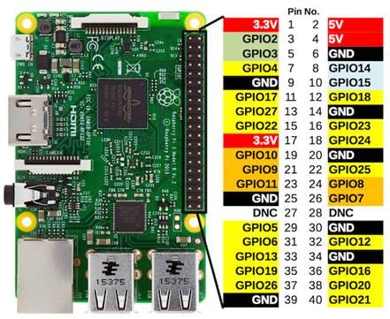

# Setup For SmartBulb

[]

-   Yellow to 3.3V
-	Red to GPIO17
-	White to GPIO27
-	Black to GPIO18

You need IoT Core Dashboard to upload a new firmware https://docs.microsoft.com/en-us/windows/iot-core/connect-your-device/iotdashboard
Once a Raspberry Pi is connected to the same network as your computer, it will appear on IoT Core Dashboard, you want to:

-	Right click on the device
-	Open Portal
-	Username: Administrator, Password: Edison1234
-	On the portal, go to “Apps”
-	Next to the application there should be a switch turned on (blue) on “Startup”, turn it off.
-	Refresh the page, then in the actions drop down, click uninstall
-	Refresh the page, click “Add” (might be slightly different)
-	Drag & Drop or select the firmware Edison.Devices.SmartBulb_1.0.2.0_arm.appxbundle. It should not require any new dependency
-	Once install, turn the startup switch back on

It should work instantly.

If you need quick debug, ETW ids:
-	Smartbulb: 26fcf049-de51-4fe4-9015-8a0245fa8aa8
-	SoundSensor:  8e2fb18a-e7ae-45f9-bf05-d42455ba6ce0

On 1.0.2 firmware you get blinking light confirmation when network issues happen (can be deactivated by desired property IgnoreFlashAlerts at true/false)
-	Blinks green for 2 seconds when the network is ready/reestablished
-	Blinks red for 2 seconds if connection is lost/not established to iot hub.
-	Blinks purple for 2 seconds if general error. In this case the app will restart on its own. L

1.0.2 for sound sensor doesn’t have light but have the same several improvements to help recover from lost connection